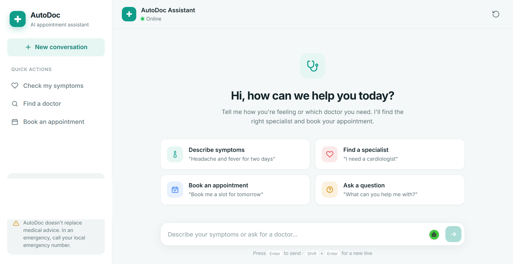
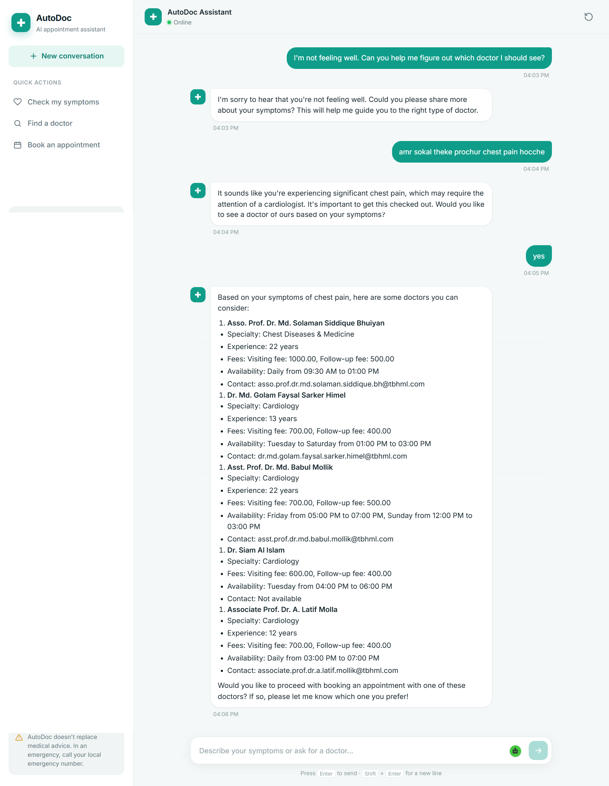
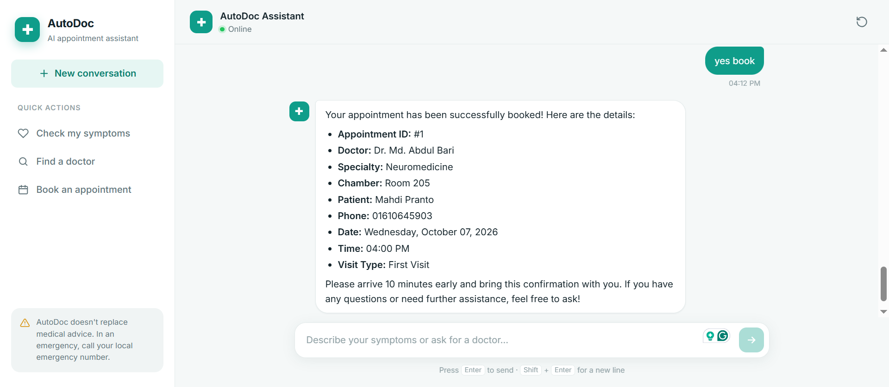
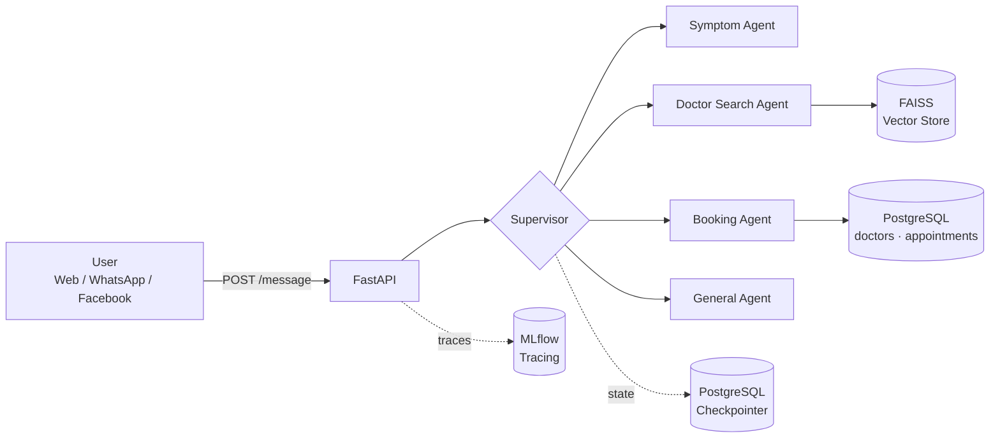

<div align="center">

---

## 📖 Overview

**AutoDoc** is a conversational doctor appointment booking system powered by a team of specialized AI agents. A **supervisor agent** reads each message and the current booking stage, then hands it to the right sub-agent: one understands symptoms, one finds doctors with vector search (RAG), and one books the appointment in PostgreSQL.

Conversation state is persisted with a PostgreSQL-backed LangGraph checkpointer, so users can pick up where they left off. The agent graph is exposed through a FastAPI backend with a built-in web chat frontend, and the API is channel-aware so it can also sit behind WhatsApp or Facebook Messenger.

## ✨ Features

- **🧠 Symptom understanding** – interprets free-text complaints (including mixed Bangla/English, e.g. *"amr sokal theke prochur chest pain hocche"*) and suggests the right specialty.
- **🔍 Semantic doctor search** – FAISS vector store with `all-MiniLM-L6-v2` embeddings finds matching doctors with specialty, experience, fees, and availability.
- **📅 End-to-end booking** – checks available slots, collects patient details, and writes a confirmed appointment to PostgreSQL.
- **🧭 Supervisor routing** – a central router picks the correct agent for every turn and blocks booking until a doctor is selected.
- **💾 Persistent memory** – LangGraph + PostgreSQL checkpointer keeps conversation state per user and channel.
- **💬 Clean web UI** – responsive chat interface with quick actions, suggestion cards, and Markdown-rendered replies.
- **📊 LLM observability** – MLflow Tracing records every conversation turn: supervisor routing, agent steps, tool calls, and LLM prompts/responses with latency and token usage, grouped by user and session.

## 📸 Screenshots

### Chat home

A welcoming landing screen with quick actions and example prompts.



### Symptom check → doctor search

The user describes symptoms; AutoDoc identifies the likely specialty and recommends matching doctors with fees and availability.



### Appointment confirmation

After the user picks a doctor and slot, the booking agent confirms the appointment with full details.



## 🏗️ Architecture



Every message enters the graph at the **supervisor**, which sets `next_agent` based on the conversation and booking stage. The chosen agent replies, the state is checkpointed, and the turn ends. The next message re-enters at the supervisor.

| Agent                   | Responsibility                                                    |
| ----------------------- | ----------------------------------------------------------------- |
| `supervisor`          | Routes each message to the right agent and enforces booking order |
| `symptom_agent`       | Collects symptoms and suggests a medical specialty                |
| `doctor_search_agent` | Runs RAG search and confirms the doctor selection                 |
| `booking_agent`       | Looks up slots, gathers patient info, creates the appointment     |
| `general_agent`       | Handles greetings and general questions                           |

### Booking flow

1. The user describes their symptoms.
2. The supervisor routes to the **symptom agent**, which suggests a specialty.
3. The supervisor routes to the **doctor search agent**, which retrieves matching doctors and confirms the user's choice.
4. The supervisor routes to the **booking agent**, which fetches available slots, collects patient details, and books the appointment.

## 🛠️ Tech Stack

| Layer               | Technology                                                   |
| ------------------- | ------------------------------------------------------------ |
| Agent orchestration | LangGraph, LangChain                                         |
| LLM                 | OpenAI `gpt-4o-mini`                                         |
| Retrieval           | FAISS, HuggingFace `sentence-transformers/all-MiniLM-L6-v2`  |
| Backend             | FastAPI, Uvicorn, Pydantic                                   |
| Database & memory   | PostgreSQL, `langgraph-checkpoint-postgres`, psycopg         |
| Observability       | MLflow Tracing (LangChain/LangGraph autolog)                 |
| Frontend            | HTML (Jinja2), CSS, vanilla JavaScript                       |

## 🚀 Getting Started

### Prerequisites

- Python 3.11+
- PostgreSQL
- An OpenAI API key

### 1. Clone and install

```bash
git clone https://github.com/mahdi-islam-pranto/AutoDoc.git
cd AutoDoc

python -m venv .venv
# Windows
.venv\Scripts\activate
# macOS / Linux
source .venv/bin/activate

pip install -r requirements.txt
```

### 2. Configure environment variables

Create a `.env` file in the project root:

```ini
P_DB_HOST=localhost
P_DB_PORT=5432
P_DB_NAME=your_database
P_DB_USER=your_user
P_DB_PASSWORD=your_password
OPENAI_API_KEY=your_openai_api_key

# Optional: where MLflow stores traces (defaults to the local sqlite:///mlflow.db)
# MLFLOW_TRACKING_URI=http://localhost:5000
```

### 3. Set up the database

Create the `doctors` and `appointments` tables using the SQL in [`dbtablequeries.txt`](dbtablequeries.txt), then load your doctor data.

### 4. Run the app

```bash
uvicorn main:app --reload
```

Open **http://127.0.0.1:8000** to use the chat UI. Interactive API docs are at **http://127.0.0.1:8000/docs**.

## 📊 Observability with MLflow

AutoDoc uses [MLflow Tracing](https://mlflow.org/docs/latest/genai/tracing/) to make every agent decision inspectable. Tracing is enabled automatically when the app starts — no extra setup needed.

**What gets traced**

- `mlflow.langchain.autolog()` captures the full LangGraph run: supervisor routing, each agent node, tool calls (doctor search, slot lookup, booking), and every OpenAI call with prompts, responses, latency, and token usage.
- Each `/message` request is wrapped in a single `handle_message` root span, tagged with:
  - `mlflow.trace.user` – the user ID
  - `mlflow.trace.session` – the conversation thread (`<channel>:<user_id>`)
  - `channel` – `web`, `whatsapp`, or `facebook`

This lets you follow a whole conversation turn by turn, or filter traces per user.

**Viewing traces**

By default, traces are stored in a local SQLite database (`mlflow.db`) in the project root. With the app running, start the MLflow UI in a second terminal:

```bash
mlflow ui --backend-store-uri sqlite:///mlflow.db --port 5000
```

Then open **http://127.0.0.1:5000**, select the **"Medical Booking Agent - LLM Observability"** experiment, and go to the **Traces** tab. Click any trace to see the span tree:

```
handle_message
└── LangGraph
    ├── supervisor
    └── doctor_search_agent
        ├── ChatOpenAI
        └── doctor search tool
```

To send traces to a remote MLflow server instead, set `MLFLOW_TRACKING_URI` in `.env`.

> **Note:** Traces contain full conversation content, including patient names and phone numbers. Keep `mlflow.db` out of version control.

## 🔌 API

### `GET /`

Serves the AutoDoc web chat frontend.

### `POST /message`

Sends a user message through the agent graph.

**Request**

```json
{
  "message": "I have chest pain and shortness of breath",
  "user_id": "user123",
  "channel": "web"
}
```

| Field       | Type   | Description                                          |
| ----------- | ------ | ---------------------------------------------------- |
| `message` | string | The user's text                                      |
| `user_id` | string | Unique user identifier (phone number, FB PSID, etc.) |
| `channel` | string | `web` (default), `whatsapp`, or `facebook`     |

**Response**

| Field               | Description                      |
| ------------------- | -------------------------------- |
| `response`        | The agent's reply message        |
| `langfuse_traces` | Placeholder for tracing metadata |

## 📁 Project Structure

```
AutoDoc/
├── main.py                 # FastAPI app: chat UI, /message endpoint, MLflow tracing setup
├── schemas.py              # Pydantic request/response models
├── config/                 # App lifespan, DB config, agent setup
├── graph/
│   ├── graph.py            # LangGraph state graph and routing
│   ├── state.py            # Conversation state (stage, doctor, patient)
│   ├── supervisor/         # Supervisor router
│   └── agents/             # symptom, doctor_search, booking, general
├── rag/                    # Document loading, vector store, retrieval
├── vectorstore/db_faiss/   # Prebuilt FAISS index
├── memory/                 # PostgreSQL checkpointer
├── service/                # Graph invocation and tool services
├── utilities/
│   ├── tools/              # Agent tools (search, booking, symptoms, info)
│   ├── prompts/            # Agent prompts
│   └── helper.py           # DB URI, connection pool, graph config
├── templates/index.html    # Chat UI
├── static/                 # CSS and JS for the frontend
└── screenshots/            # README images
```

## 🗺️ Roadmap

- [X] Web chat frontend
- [X] LLM observability with MLflow Tracing
- [ ] WhatsApp and Facebook Messenger integration
- [ ] Stronger agent validation and response formatting
- [ ] Richer doctor database and availability model
- [ ] Unit and end-to-end tests for conversation flows
- [ ] Structured logging (replace debug prints)

## ⚠️ Disclaimer

AutoDoc is a portfolio and research project. It does **not** provide medical advice or diagnosis. In an emergency, contact your local emergency number.

---

<div align="center">
